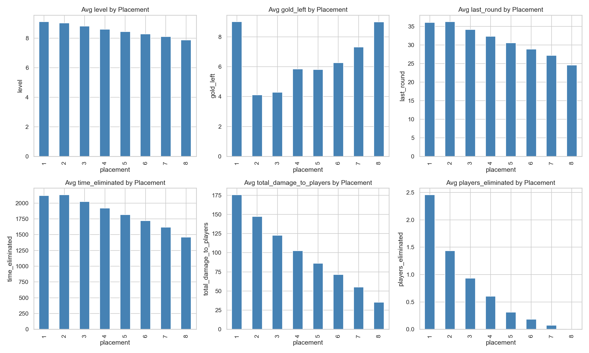
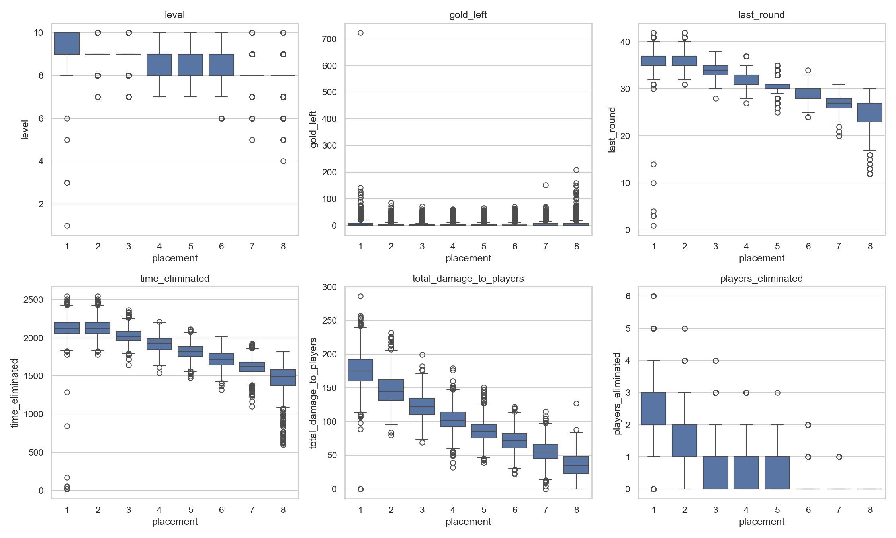
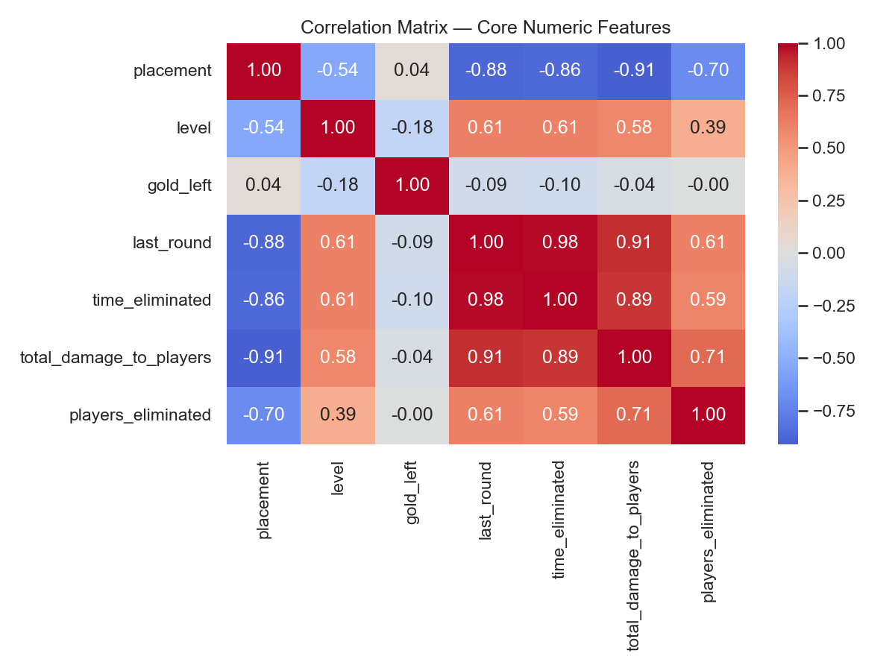
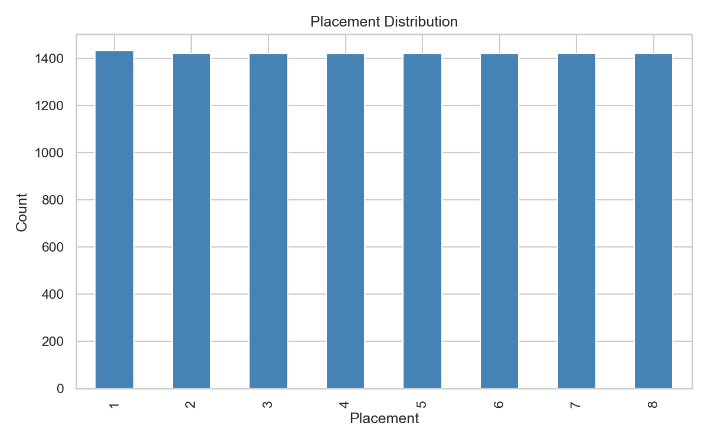
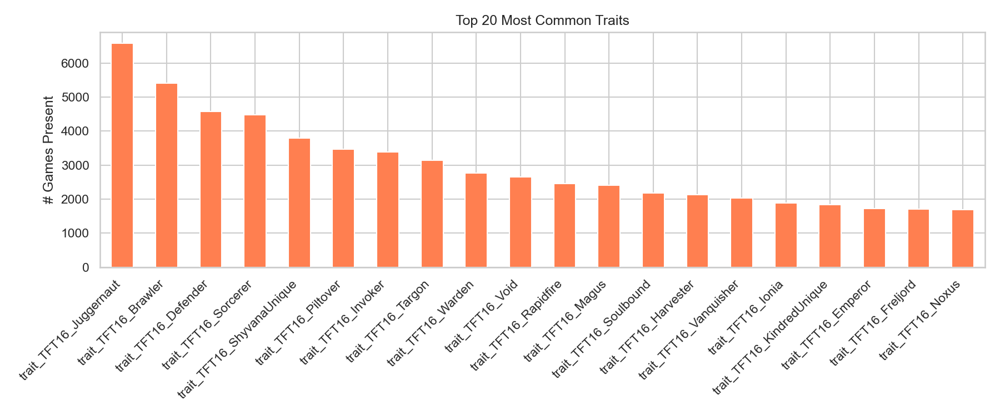
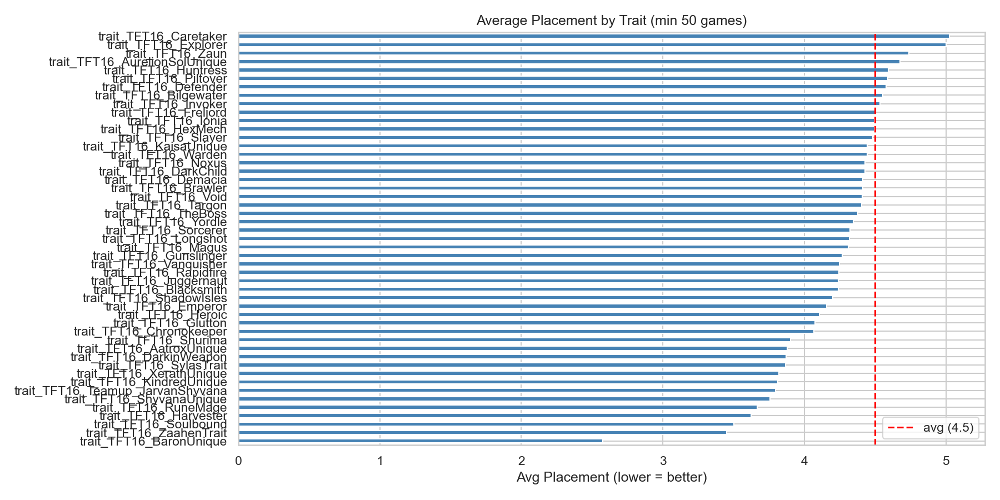
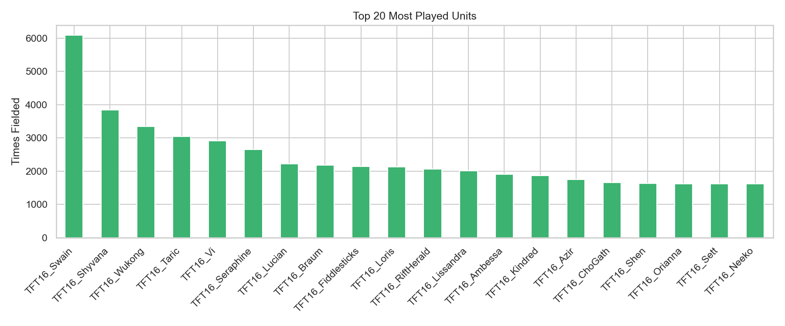
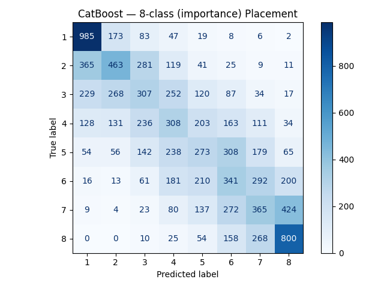
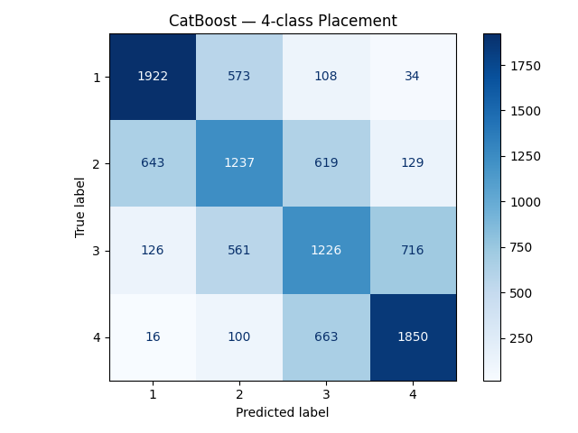
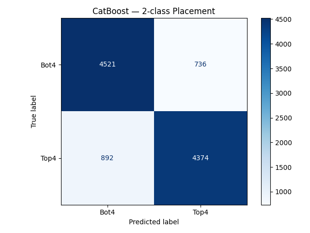

# TFT Placement Predictor

An educational data science project built to demonstrate ETL pipeline construction and machine learning model training using real competitive game data.

This project collects match data from Riot Games' Teamfight Tactics API for the top EUW players (Challenger & Grandmaster), processes it into a structured dataset, performs exploratory data analysis, and trains a CatBoost classifier to predict match placements.

> This is a modernization of the original [PH-TFT project](https://github.com/rndmagtanong/ph_tft), upgraded from RandomForest to CatBoost and rebuilt with a fully functional ETL pipeline compatible with the current Riot API.

---

## Table of Contents

- [What is TFT?](#what-is-tft)
- [Tech Stack](#tech-stack)
- [Project Structure](#project-structure)
- [How to Run](#how-to-run)
- [ETL Pipeline](#etl-pipeline)
- [Exploratory Data Analysis](#exploratory-data-analysis)
- [Model Training](#model-training)
- [Results](#results)
- [Limitations & Recommendations](#limitations--recommendations)

---

## What is TFT?

Teamfight Tactics (TFT) is an auto-battler game by Riot Games where 8 players compete by assembling combinations of units, traits, augments, and items. Each game ends with placements from 1st to 8th. Placements 1–4 count as wins (gain LP), placements 5–8 count as losses (lose LP).

The core question this project tries to answer: **can we predict where a given board composition will place?**

---

## Tech Stack

- **Python 3.10**
- **ETL:** `riotwatcher`, `requests`, `pandas`, `python-dotenv`
- **EDA:** `matplotlib`, `seaborn`
- **ML:** `catboost`, `scikit-learn`
- **Data source:** [Riot Games TFT API](https://developer.riotgames.com/apis)
- **Name resolution:** [Data Dragon](https://developer.riotgames.com/docs/lol#data-dragon)

---

## Project Structure

```
TFT-Project/
├── etl.py                    # ETL pipeline (Extract, Transform, Load)
├── eda.py                    # Exploratory Data Analysis
├── catBoost.py               # CatBoost model training
├── requirements.txt          # Python dependencies
├── .env                      # API key (not committed)
├── data/
│   ├── match_data.csv        # Processed match data (generated)
│   └── raw_matches.json      # Cached raw API responses (generated)
├── eda/                      # EDA visualizations
└── confusion_matrixes/       # Model confusion matrices
```

## ETL Pipeline

The pipeline is split into three phases in `etl.py`:

### Extract
- Fetches Challenger and Grandmaster player PUUIDs from the TFT League API (up to 100 players per tier)
- Collects the last **50 match IDs** per player, deduplicated across the full player pool
- Fetches full match detail JSON for each unique match
- Raw responses are **cached to `data/raw_matches.json`** so the transform step can be rerun without new API calls

### Transform
- `flatten_match()` extracts one row per participant (8 rows per match) with:
  - Placement, level, gold left, last round, damage dealt, players eliminated
  - Augments (up to 3, stored as separate columns)
  - Active traits with their unit count
  - Units with name (resolved via Data Dragon), tier, and equipped items
- Double Up game mode matches are automatically skipped
- `clean_dataframe()` drops fully empty columns and rows

### Load
- Cleaned DataFrame is written to `data/match_data.csv`

**Data flow:**
```
Riot API → raw JSON (cached) → flatten_match() → clean_dataframe() → match_data.csv
```

---

## Exploratory Data Analysis

Run `eda.py` after the ETL to generate visualizations in `eda/`. Beyond just plotting distributions, the EDA revealed a critical data quality issue that directly shaped the model.

### Identifying Leaky Features

The numeric features vs. placement charts and the correlation heatmap showed that `last_round`, `time_eliminated`, `total_damage_to_players`, and `players_eliminated` all have very strong, near-perfect correlations with placement.







This correlation is misleading — these features are **consequences of placement, not causes**. A player who finishes 1st naturally survives more rounds, deals more damage over time, and eliminates more opponents. Including them would teach the model to predict "how long did you play" rather than "is this composition strong." This was confirmed after an initial training run where the feature importance showed these four features accounting for **~84% of the model's total importance**, leaving only 16% for the actual composition data.

These features were removed before final model training.

### Placement Distribution


### Most Played Traits


### Average Placement by Trait


### Most Played Units



---

## Model Training

`catBoost.py` trains a **CatBoost multi-class classifier** to predict placement (1–8).

**Why CatBoost?**
- Handles categorical features (unit names, augment names, trait names) natively without manual encoding
- Strong out-of-the-box performance on tabular data
- Built-in support for early stopping to prevent overfitting

**Configuration:**
```python
CatBoostClassifier(
    iterations=500,
    depth=6,
    learning_rate=0.05,
    l2_leaf_reg=3.0,
    loss_function='MultiClass',
    early_stopping_rounds=50,
)
```

- 80/20 train/test split with a fixed random seed for reproducibility
- Categorical features are auto-detected from string/category dtype columns
- Early stopping monitors the test set and halts training when accuracy plateaus
- After training, the top 20 most important features are printed
- The trained model is saved to `catboost_model.cbm` for reuse

---

## Results

### Confusion Matrices

#### 8-Class — Predict exact placement (1st through 8th)



**Accuracy: 36.5%**

Predicting exact placement out of 8 is the hardest task. Random chance would be 12.5%, so the model is extracting real signal from composition data — but TFT's inherent variance puts a hard ceiling on this framing.

#### 4-Class — Paired placements ([1,2], [3,4], [5,6], [7,8])



**Accuracy: 50.3%**

Grouping placements into pairs improves accuracy significantly. The model captures meaningful patterns about which compositions tend to finish in the top vs. bottom half of each bracket.

#### 2-Class — Top 4 win vs. Bottom 4 loss



**Accuracy: 84.5%**

The most practically useful framing, directly aligned with how TFT is played — a win is top 4, a loss is bottom 4. The model performs well enough here to be genuinely informative about which compositions are strong.

---
